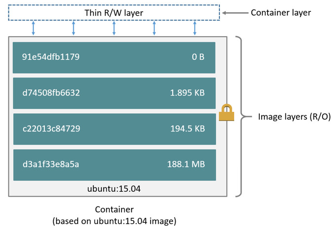

# 1. 구조와 원리
> 컨테이너의 레이어 구성은 __베이스 이미지 레이어들__ + __컨테이너 레이어__ 로 구성됨  
> 어떤 이미지를 run을 통해서 생성및 실행하면 컨테이너는 기본 적으로 이미지를 구성하는 레이어들을 가지고 오고 그리고 컨테이너 레이어 라는걸 생성하여 두 가지 레이어를 합쳐서 컨테이너를 생성한다.

**밑 그림을 보자 초록색 부분이 ubuntu이미지의 레이어들이다 그리고 그 위에 컨테이너 레이어가 있다 이렇게 컨테이너 레이어가 구성된다**

>이미지 레이어들은 R/O (ReadOnly)이다. 왜냐하면 베이스 이미지의 레이어에 변경을 가한다면 똑같은 베이스 이미지로 하는 다른 컨테이너를 생성할때 문제가 발생 하기 때문이다. 
즉, 컨테이너 생성시 베이스 이미지의 레이어를 복사해서 컨테이너를 따로 구성 하는것이 아닌 원본 레이어를 여러 컨테이너와 같이 공유하는 것이다 (유니온 파일 시스템) 이 것이 overlay2 시스템이 존재하는 가장 큰 이유일 것이다. 
컨테이너 레이어는 사용자가 R/W(ReadWrite)를 할 수 있다.
