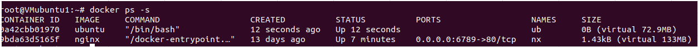

# 2. 직접 확인

1. 우분투 컨테이너를 생성 하기 전의 레이어들이다 ( 가지고 있는 이미지들의 레이어와 nginx 컨테이너 하나가 실행 중이다)

2. 우분투 이미지를 베이스로한 컨테이너를 생성 

3. 하이라트된 부분이 새로 생긴것을 알수 있다 이것이 컨테이너 레이어인 것이다. 

> __그렇다면 R/W 가능한 레이어가 생성 되었으니 한번 수정을 가해 보겠다.__

4. 생성한 ub컨테이너(ubuntu base) 에 test디렉토리와 hi.txt파일 을 생성 했다 

> __수정한 것을 보려면 "docker inspect ub" 입력__  
> LowerDir 의 .../overlay2/"레이어 이름" 들이 아마도 베이스 이미지의 레이어들 일 것 같다  나머지 MergeDir , UpperDir, WorkDir  모두 같은 .../overlay2/"레이어이름"/... 을 가지고 있다 이 레이어가 컨테이너 레이어 일 것이다 

5. 해당 레이어 디렉토리로 들어간다 

6. merge 디렉토리에 보면 생성한 test 디렉토리가 있고 들어가면 hi.txt가 있다( 안쪽은 생략) 

>merge  디렉토리는 컨테이너가 실행중일때(run)일 때만 생선된다 컨테이너가 stop이면 merge 디렉토리가 사라진다

7. diff 디렉토리에 들어가면 test 디렉토리가 있다 한번 tree 를 찍어보면 

8. 컨테이너 레이어에서 생성한 test 디렉토리와 hi.txt파일인 것을 알수있다!  
즉, diff 디렉토리는 새로 생성되거나 변경사항들만 저장 하는 디렉토리인 것을 알수 있다 

9. 이 diff 를 명령어를 통해서 확인 할 수 있다  

>어떤 작업 앞에 A,C,D 가 붙는데 
A - 새로 생성된 것 C - 변경 된것  D - 삭제 된것

10. 이 컨테이너를 commit 하면 

11. 하이라이트 된 부분이 새로 만들어지고 이건 컨테이너 레이어가 "ub333" 이미지만의 레이어가 생성된 것이고  "ub333"이미지를 베이스로 컨테이너를 새로 생성해서 확인하면 전에 변경된 내용들을 확인 할수 있다. 

12. ub 컨테이너를 삭제하니까 기존에 있던 (9ca.....) 레이어는 사라지지만 새로 생성된 (f58....)레이어는 그대로 있는것을 확인할 수 있다. 

> 즉,어떤 레이어가 수정된 레이어인지는 확인 할 수 있고 어떤 내용이 있는지 까지도 확인 할 수 있다.

---

> **추가**  
history 명령어로 확인 할수 있다. 

아래 명령어로 확인해보면 수정이 가해진 후에는 SIZE 의 크기가 변경된다 (ub 변경되기 전에 캡쳐함) 

---

> - LowerDir: these are the read-only layers of an overlay filesystem. For docker, these are the image layers assembled in order.
> - UpperDir: this is the read-write layer of an overlay filesystem. For docker, that is the equivalent of the container specific layer that contains changes made by that container.
> - WorkDir: this is a required directory for overlay, it needs an empty directory for internal use.
> - MergedDir: this is the result of the overlay filesystem. Docker effectively chroot's into this directory when running the container.
